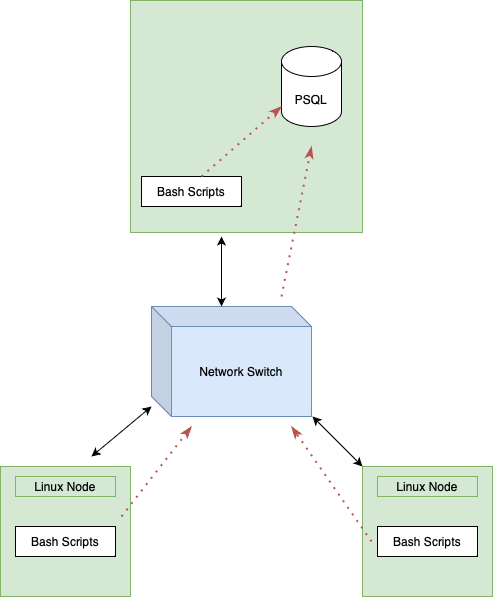

# Linux Cluster Monitoring Agent

## Introduction

The Linux Cluster Monitoring Agent is a powerful tool designed to monitor and track the resource usage statistics of multiple servers within a Linux cluster. The system utilizes a series of scripts that initialize and maintain a PostgreSQL database within a Docker container, which is used to store detailed information such as hardware specifications and usage data for each node in the cluster. The agent uses bash scripts to collect and populate data into the database, with usage data being recorded every minute through the use of crontab, a time-based job scheduler. This allows users to generate real-time resource usage reports and make informed decisions regarding resource planning and allocation. The primary objective of the project is to create a tool for the Linux Cluster Administration team to monitor and manage the resources of each server within the cluster, using a combination of Bash, Docker, Git, PostgreSQL and Remote Desktop with CentOS 7 installed, the MVP was created with each feature merged together with reference to Gitflow. With this powerful tool, the LCA team can gather data to generate reports for future resource planning purposes, such as adding or decreasing the number of nodes required for their current purpose.

## Quick Start

```bash
# Start a PSQL instance using psql_docker.sh
./scripts/psql_docker.sh create [db_username] [db_password]

# Create tables using ddl.sql
psql -h localhost -U [db_username] -d host_agent -f sql/ddl.sql

# Insert hardware specs data into the DB using host_info.sh
./scripts/host_info.sh [psql_host] [psql_port] host_agent [db_username] [db_password]

# Insert hardware usage data into the DB using host_usage.sh
./scripts/host_usage.sh [psql_host] [psql_port] host_agent [db_username] [db_password]

# Crontab setup to execute host_usage.sh every minute
crontab -e
# In the editor which opens, add the line below to collect usage statistics every minute
* * * * * bash [full/path/to]/linux_sql/scripts/host_usage.sh [psql_host] [psql_port] host_agent [db_username] [db_password] &> /tmp/host_usage.log
```

## Implementation

1. Set up a Linux server running CentOS 7 and install Docker.
2. Use Docker to create a PSQL instance.
3. Install the PSQL command-line client and configure a PSQL database.
4. Create the 'host_info' table to store hardware information and the 'host_usage' table to store real-time server usage data.
5. Create an agent to collect hardware specifications and insert the data into the database.
6. Create an agent to collect server usage data and insert it into the database.
7. Use crontab to automate the 'host_usage' agent to generate real-time server usage data.

## Architecture



Each individual Linux machine is interconnected via a switch. A designated node holds the PSQL instance and can transmit the output from its scripts directly to the database. The remaining nodes, however, must transmit their results through the switch before they can reach the PSQL instance.

### Scripts

This section will describe each shell script.

- _psql_docker.sh:_
  - The purpose of this script is to create and manage a PostgreSQL database within a Docker container. It takes three input variables: an input command (create, start, or stop), a username, and a password. The script first checks the status of the Docker container and then uses a switch case statement to create, start, or stop the container based on the input command.
- _host_info.sh:_
  - This script is designed to collect hardware specifications and insert the data into the PostgreSQL instance. It requires five input variables: psql_host, psql_port, db_name, psql_user, and psql_password. The script checks the number of input arguments, then gathers information such as hostname, CPU number, architecture, model, MHz, L2 cache, timestamp, and total memory, and inserts the data into the PostgreSQL database.
- _host_usage.sh:_
  - This script is used to collect and store server usage data in the PostgreSQL database. It takes the same input variables as host_info.sh and also checks the number of input arguments. It collects usage data such as timestamp, host ID, memory free, CPU idle, CPU kernel, disk I/O, and disk available, and inserts it into the PostgreSQL database.
- _crontab:_
  - This script is used to deploy the monitoring app on each server and collect data every minute. It runs host_usage.sh every minute, which results in the storage of hardware usage specifications into the PostgreSQL database every minute.
- _queries.sql:_
  - This script contains various SQL queries that can be used to retrieve and analyze the data stored in the PostgreSQL database. These queries can be used to solve various business problems, such as identifying trends in server usage and identifying potential performance bottlenecks.

## Database Modeling

The host_agent database is built using PostgreSQL and provisioned using Docker. It contains two main tables: host_info and host_usage, which store information about the hardware specifications and usage statistics of the host, respectively.

The host_info table is used to store information about the hardware specifications of the host. It contains the following fields:

| Field              | Description                                                  |
| ------------------ | ------------------------------------------------------------ |
| `id`               | Auto-incremented unique identifier for the host              |
| `hostname`         | Unique name for the host                                     |
| `cpu_number`       | Number of cores on the host's CPU                            |
| `cpu_architecture` | Architecture of the host's CPU                               |
| `cpu_model`        | Name of the host's CPU model                                 |
| `cpu_mhz`          | Clock speed of the host's CPU, in MHz                        |
| `L2_cache`         | Size of the host's L2 cache, in KB                           |
| `total_mem`        | Total amount of memory on the host                           |
| `timestamp`        | Timestamp of when the hardware specifications were collected |

The host_usage table is used to store statistics about the usage of the host's resources. It contains the following fields:

| Field            | Description                                              |
| ---------------- | -------------------------------------------------------- |
| `timestamp`      | Timestamp of when the usage statistics were collected    |
| `host_id`        | ID of the corresponding entry in the host_info table     |
| `memory_free`    | Amount of free memory on the host                        |
| `cpu_idle`       | Percentage of time that the host's CPU is idle           |
| `cpu_kernel`     | Percentage of time the host's CPU is running kernel code |
| `disk_io`        | Number of disks currently undergoing I/O processes       |
| `disk_available` | Available space in the host's root directory, in MB      |

## Test

- The testing process for the host_agent database includes two main steps:

1. Verifying the creation of the tables using the `psql -h localhost -U postgres -d host_agent -f sql/ddl.sql` script.
2. Testing the bash scripts located in the host_info and host_usage directories for DDL by running each command in the CLI using the format echo "$command" and then adding the output to their respective files.

```bash
  #To begin, the psql_docker.sh script is used to check if the jrvs-psql container is running:
  docker container ls -a -f name=jrvs-psql
```

- Then, the `psql -h localhost -U postgres -d host_agent -f sql/ddl.sql` script is executed to create the tables in the host_agent database.
- The host_info and host_usage bash scripts are then run and the output is captured by executing the following commands:

```bash
	echo "$(bash host_info/ddl.sh)" >> host_info_ddl_output.log
	echo "$(bash host_usage/ddl.sh)" >> host_usage_ddl_output.log
```

## Deployment

For the deployment of this project, we utilized a combination of modern tools and technologies to ensure efficient and streamlined operation. A Docker container was created and initialized to host a PostgreSQL instance, and we used crontab to schedule regular execution of the `host_usage.sh` script on a minute-by-minute basis. Additionally, we employed GitHub to manage the development and integration of new features for the MVP. With this approach, we were able to effectively deploy and maintain the project, leveraging the power of GitHub, Docker, and crontab to achieve optimal results.
GitHub is used to manage the creation and merging of features for the MVP.

## Improvements

- Implement a comprehensive monitoring system to detect and alert on failed nodes in real-time
- Incorporate a user-friendly interface for easy access and visualization of data
- Implement a feature for suggesting node addition or removal based on resource usage patterns
- Expand the capabilities of the query engine to enable more advanced analytics and reporting
